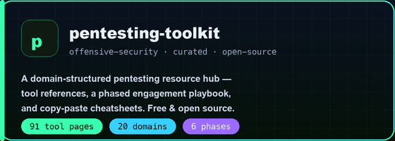
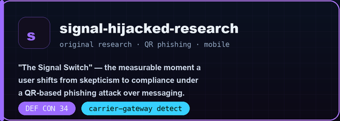

<!-- ===================== HERO ===================== -->
<p align="center">
  
</p>

<p align="center">
  <a href="https://git.io/typing-svg"></a>
</p>

<p align="center">
  
  <a href="https://github.com/sudobittu?tab=followers"></a>
  
</p>

---

### `$ whoami`

```bash
sudobittu — Independent Security Researcher

focus       : penetration testing · red teaming · QR/mobile phishing research
building    : curated, always-current, free & open-source security tooling
disclosure  : DEF CON 34 — Telecom Village (The Signal Switch)
principle   : everything shipped is for authorized, ethical testing only
```

---

## 🛠️ Featured Work

<p align="center">
  <a href="https://github.com/sudobittu/pentesting-toolkit"></a>
  &nbsp;
  <a href="https://github.com/sudobittu/signal-hijacked-research"></a>
</p>

<p align="center">
  <a href="https://github.com/sudobittu/pentesting-toolkit"></a>
  <a href="https://github.com/sudobittu/pentesting-toolkit"></a>
  <a href="https://github.com/sudobittu/pentesting-toolkit"></a>
  &nbsp;&nbsp;
  <a href="https://github.com/sudobittu/signal-hijacked-research"></a>
  <a href="https://github.com/sudobittu/signal-hijacked-research"></a>
</p>

---

## 🧰 Arsenal &amp; Tech

<p align="center">
  
  
  
  
  
  
</p>
<p align="center">
  
  
  
  
  
</p>

---

## 🔥 Activity

<p align="center">
  
</p>

<p align="center">
  
</p>

<p align="center"><sub>⚖️ Everything I build and share is for authorized, ethical security testing only.</sub></p>
